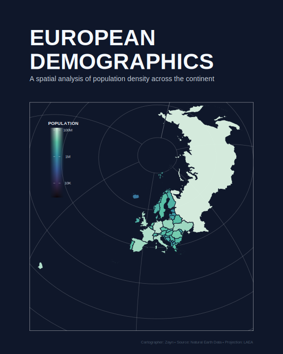

# European Demographics Poster

A high-contrast population density map of Europe using LAEA (Lambert Azimuthal Equal-Area) projection.

Built with **ggplot2**, **sf**, and **rnaturalearth**.

Features:

- LAEA projection centered on Europe (`lat_0=52, lon_0=10`)
- Log-scaled population fill via `viridis::mako` color palette
- Dark-themed poster design with graticule overlay
- 8×12 inch print-ready output at 300 DPI

Preview:

